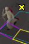

# Tick dance aim trainer plugin

Highlights randomly generated tiles.

Useful for improving your movement for PvP and PvM. Throw in switches between ground clicks for additional difficulty.

Shift right click the ground to set the area where tiles should be generated in.

